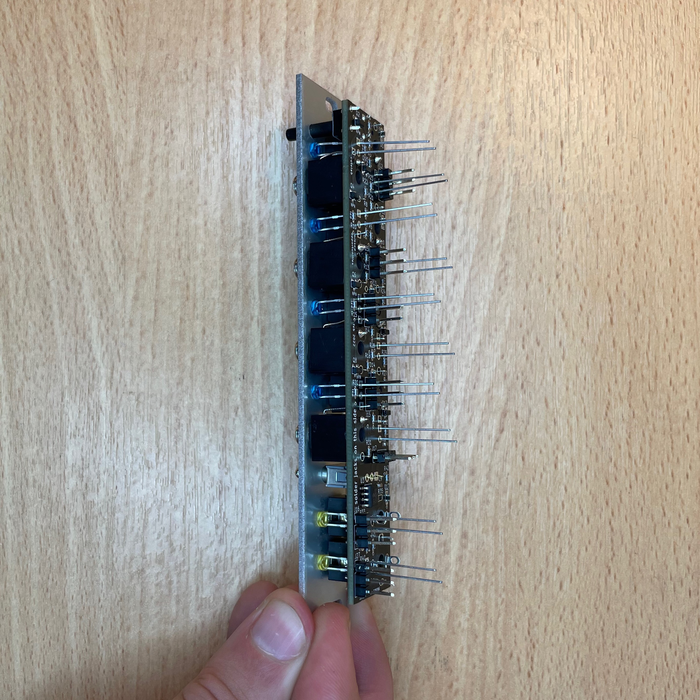

# Missed Ops DIY Kit Instructions

Hi and thanks for buying the Missed Ops DIY kit. This is the build guide for the September 2021 hardware revision. If you've got a push button switch in your kit, this is the version for you.

## Contents

Your kit should contain:

- 10 3-pin headers
- 7 3-pin sockets
- 8 PJ398 jacks
- 2 PJ301 jacks
- 1 switch
- 1 toggle
- 10 nuts
- 1 PCB layer 1
- 1 PCB layer 2
- 1 Missed Ops aluminum face panel
- 4 blue LEDs
- 4 green LEDs
- 2 yellow LEDs
- 1 10-pin header
- 1 jumper (blue or green, but probably blue)
- 1 potentiometer
- 1 ribbon cable

## Building

### 1. Get the base board and the pin sockets

The base board is the one with Missed Opportunities written on it.

### 2. Start by soldering the two outer pin sockets (J18 and J22)

The plastic on the socket should be the same side as the white outline around the pads. This is true for all the pin headers and sockets.

You only need to solder one pin on each for now, to hold everything in place.

### 3. Solder the four inner pin sockets (J19, J20, J21, J23)

Again, for now you only need to solder the inner pins. Make sure the plastic of the sockets is flush with the PCB.

### 4. Put the seven 3-pin headers into the pin sockets

Make sure to insert the longer side of the header, so the shorter side sticks out.

### 5. Align the top board, and slide the board onto the pins (J12, J13, J14, J15, J16)

### 6. Solder the pin you've just inserted through the top board, then solder the remaining pins on the bottom board

### 7. Separate the boards, gently pulling from both sides

### 8. Insert the 100k trimmer potentiometer and solder it in place (RV1)

### 9. Solder the 2x5 power header (J26)

### 10. (Optional) Solder two 3-pin headers to create a 6-pin ISP header (J24)

The Atmega on your board comes preprogrammed, so you only need these pins if you want to upload your own firmware. If you want to solder them on, there's a neat trick to making sure they're lined up. Take the jumper and the headers, then use the jumper to align the headers.

Solder on the headers, then remove the jumper.

### 11. Solder on the 3-pin header for the jumper (J11)

This is where the jumper belongs, so you can slide it on after soldering on the headers.

### 12. Insert the PJ-398 (Thonkiconn) jacks into the top board, soldering only the middle pin on each (J1, J2, J3, J4, J5, J6, J7, J8)

Start with the top jack, being careful to insert the ground pin into the right hole. You'll have to push it to the side slightly, as in the photo. We had to do it like this to keep the ground pin from shorting with the legs of the LED.

Now insert the remaining PJ-398 jacks, again soldering only the middle pin.

Soldering only the middle pin keeps things flexible so you can make sure the jacks are flush with the board. You can loosely fit the panel, without the nuts, to make it easier to align the jacks.

### 13. Take the PJ-301 jacks, and snip the excess metal jacket casing off the jacks

You're not snipping off the legs, just the little bit of excess metal jacket casing, so that the jack will sit flush on the PCB. This is what they look like before you snip off the excess metal jacket casing. 

Using a pair of pliers, you can cut off the extra tabs, or you can wiggle the extra tabs back and forth until they snap off.

You'll want the metal casing to be flush with the plastic part of the jack. Otherwise, the jack will sit too high on the PCB.

### 14. If needed, remove one of the ground pins from one of the jacks

Because the two PJ-301 jacks are so close together, they share a pad. Fitting pins on both into that pad can be difficult. To make it easier, you can remove one of the outer pins from one (or both) of the jacks. Do not remove the pins with solder lugs (circular holes). Each jack has two ground pins, so removing one won't cause any issues.

### 15. Insert the PJ 301 jacks, **but do not solder them yet** (J9, J10)

### 15. Insert all of the LEDs, **but do not solder them yet** (D2-D11)
**Be careful of LED orientation!** Make sure the square socket matches up with the flat side of the LED. The color for each LED is written on the PCB.

You can use different color LEDs if you want, but the resistor values for each LED were chosen for the original colors.

### 16. Insert the toggle and push button switches.

Make sure the push button is completely flush with the PCB.

### 17. Put the front panel on

You only need to use three nuts to secure the panel for now. The goal is to make sure everything is held in place and lines up correctly. Make sure that the push button can be pushed and does not stick inside the panel. Also, you'll need to be careful that the button does not short with the legs of the nearest LED. If you see something like this:

Use a pair of pliers to bend the LED legs out of the way.

### 18. Hold the module panel-side down so the LEDs fall flush with the panel

Lift the module up with the panel facing down, so that the LEDs are pulled flush to the panel. You may need to wiggle them around a bit.

### 19. Position the module panel-side down, so the LEDs stay in place, and solder the jacks, switch, and LEDs

When you solder them, be very careful that there aren't any shorts. Especially between the LEDs and jacks, make sure to leave some space between adjacent pins.

### 20. Trim the LED leads

### Snap the board together and screw on the remaining washers and nuts

And now you're done :)

## Programming

Your Missed Ops circuit boards should come pre-programmed. However, if for some reason you need to re-program them, you can use the .hex file in the `upload` directory to flash the Missed Ops program to the board. We recommend using the [AVR Pocket Programmer](https://www.sparkfun.com/products/9825) from SparkFun. If you're using this programmer, you can run the `upload.sh` script, which includes the correct settings for the fuses on the atmega chip. You'll also need the `avrdude` command line program. Check the [README.md](../upload/README.md) in `upload` for more details.
