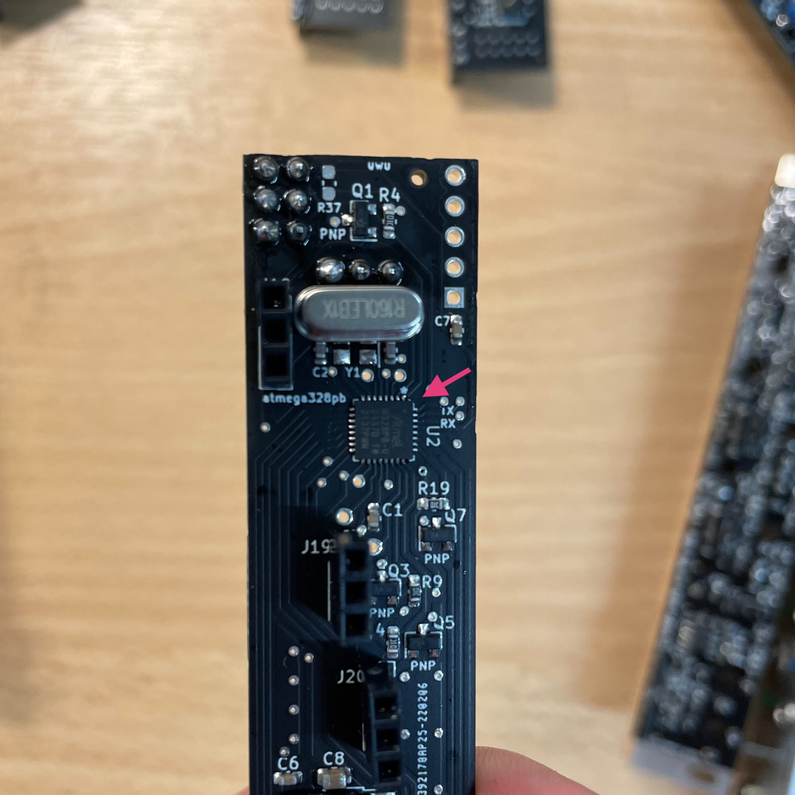
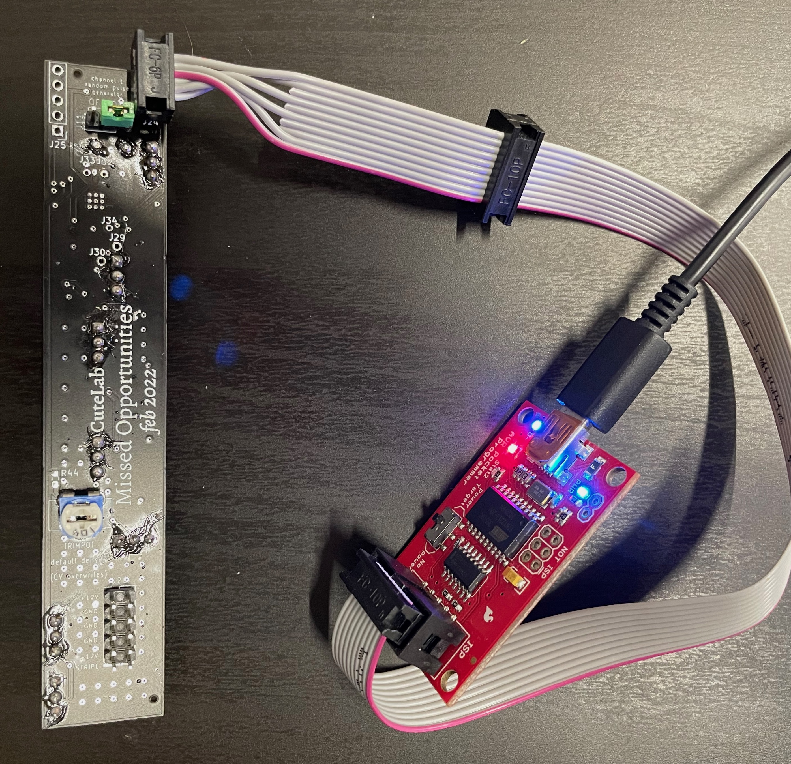

# Programming your board

Your Missed Ops circuit boards should come pre-programmed. However, if for some reason you need to re-program them, or if for some reason we forgot to program it, then you can use the .hex files in this directory to program your board. 

If you're using the [AVR Pocket Programmer](https://www.sparkfun.com/products/9825) from SparkFun, then the easiest way to do this is with the `upload.sh` scripts in each directory (read on if you're using a different programmer). It's important to use these scripts since they also include the correct fuse settings for each of the three atmega chips used in the different hardware revisions of Missed Ops. In order to figure out which chip you have, pull off the bottom PCB and look for a square chip on the inside-top. Look closely (you may need a magnifying glass) and you should be able to read the chip name, which will include either `168pa`, `328p` or `329pb`. 



We tried to color-code the jumpers as well to make it a bit easier.

- *white* - 328p
- *green* - 328pb
- *blue* - 168pa

However, it's worth looking closely at the chip to double-check. If you try to run the wrong upload script it won't hurt your chip, but if it's not working this is the first thing to check.

To run the upload script, you'll first need to download this repository. You can checkout the github repo, or just download the zip. Then, open up the terminal and navigate to the `upload` subdirectory that matches your chip. For example, if you have a `168pa` chip, you might do something like this:

```sh
cd missedops-diy/upload/168pa
./upload.sh
```

This should take care of everything else. You'll need a hardware programmer--we recommend using the [AVR Pocket Programmer](https://www.sparkfun.com/products/9825) from SparkFun. You'll also need the `avrdude` command line program.

If you are using the AVR Pocket Programmer, you'll connect the ribbon cable to the J24 jumpers on the back PCB. Be sure to connect them with the red stripe towards the center of the board, as pictured.



## Using other programmers

If you prefer to use a different programmer, you don't have to use the AVR Pocket Programmer. However, you'll need to be careful to run the correct command line program. If you've never used the command line before, you might want to familiarize yourself with the basics. You should at least know how to change the current directory, and how to print the current working directory. Mozilla provides a good getting started guide https://developer.mozilla.org/en-US/docs/Learn/Tools_and_testing/Understanding_client-side_tools/Command_line. Once you've got the basics, you're ready to program your Missed Ops.

First, connect your Missed Opportunities to your computer. You can verify that your device is connected correctly by using the `avrdude` command with the proper flags. The flags depend on your programmer and the particular chip on your Missed Opportunities (see above). For example, if you're programming with a [Pololu USB Programmer](https://www.pololu.com/product/3172), and your Missed Ops has a `328pb` chip, you can run the following command

```sh
avrdude -p m328pb -c avrispv2
```

You should see a result like:

```sh
avrdude: AVR device initialized and ready to accept instructions

Reading | ################################################## | 100% 0.01s

avrdude: Device signature = 0x1e9516 (probably m328pb)

avrdude: safemode: Fuses OK (E:F7, H:D9, L:FF)

avrdude done.  Thank you.
```

If you see a result more like:

```sh
avrdude: AVR device initialized and ready to accept instructions

Reading | ################################################## | 100% 0.01s

avrdude: Device signature = 0x1e9516 (probably m328pb)
avrdude: Expected signature for ATmega168P is 1E 94 0B
         Double check chip, or use -F to override this check.

avrdude done.  Thank you.
```

Your device is connected correctly, but the chip on Missed Opportunities is different to the one you indicated with the `-p` flag. Note the device signature that `avrdude` indicates, as the fuse settings will be different depending on the chip. If your result looks like this:

```sh
avrdude: initialization failed, rc=-1
         Double check connections and try again, or use -F to override
         this check.


avrdude done.  Thank you.
```

Then the programmer is not connected correctly. Make sure that the ribbon cable is not connected backwards, etc.

Once you're confident that the device is connected correctly, you're ready to perform the upload. Start by moving to the repository root with the `cd` command (the exact command will depend on where you placed this folder). Then, move to the appropriate folder in the `upload` directory. The name of the folder depends on the chip in your module. For example, if your Missed Ops uses the ATmega328pb chip, then from the repository root you could run:

```sh
cd upload/328pb
```

Next, run the proper `avrdude` command to perform the upload. *Be careful to use the correct upload command for your chip!* Use the `avrdude` command as described above to verify that the chip on the Missed Ops is what you think it is. The value that you provide to the `-c` flag will depend on your programmer. The value for the `-p` flag depends on the chip on your Missed Ops. Finally, the specific values given for the fuses also depends on your chip. So, if you were using the [Pololu USB Programmer](https://www.pololu.com/product/3172), and you were programming a Missed Ops with an ATmega328pb, you would run the following:

```sh
avrdude -e -Ulfuse:w:0xff:m -Uhfuse:w:0xd9:m -Uefuse:w:0xf7:m -v -p atmega328pb -C ../avrdude.conf -c avrispv2 -D -U flash:w:firmware.hex:i
```

Here's how to program each of the three chips (`168pa`, `328p` or `329pb`) used with different hardware revisions of Missed Ops. First, use the `cd` command to move to the proper directory containing the `firmware.hex` file for your chip (see above). Next, run the `avrdude` command listed below. *Careful to use the correct one, as the fuse values will be different depending on your chip!* These commands assume you're using a [Pololu USB Programmer](https://www.pololu.com/product/3172), but if you're using something different, just swap in the correct value for your programmer after the `-c` flag.

### 168pa
```sh
avrdude -e -Ulfuse:w:0xff:m -Uhfuse:w:0xdd:m -Uefuse:w:0xf9:m -v -p atmega168p -C ../avrdude.conf -c avrispv2 -D -U flash:w:firmware.hex:i
```

### 328p 
```sh
avrdude -e -Ulfuse:w:0xff:m -Uhfuse:w:0xd9:m -Uefuse:w:0xff:m -v -p atmega328p -C ../avrdude.conf -c avrispv2 -D -U flash:w:firmware.hex:i
```

### 328pb
```sh
avrdude -e -Ulfuse:w:0xff:m -Uhfuse:w:0xd9:m -Uefuse:w:0xf7:m -v -p atmega328pb -C ../avrdude.conf -c usbtiny -D -U flash:w:firmware.hex:i
```
